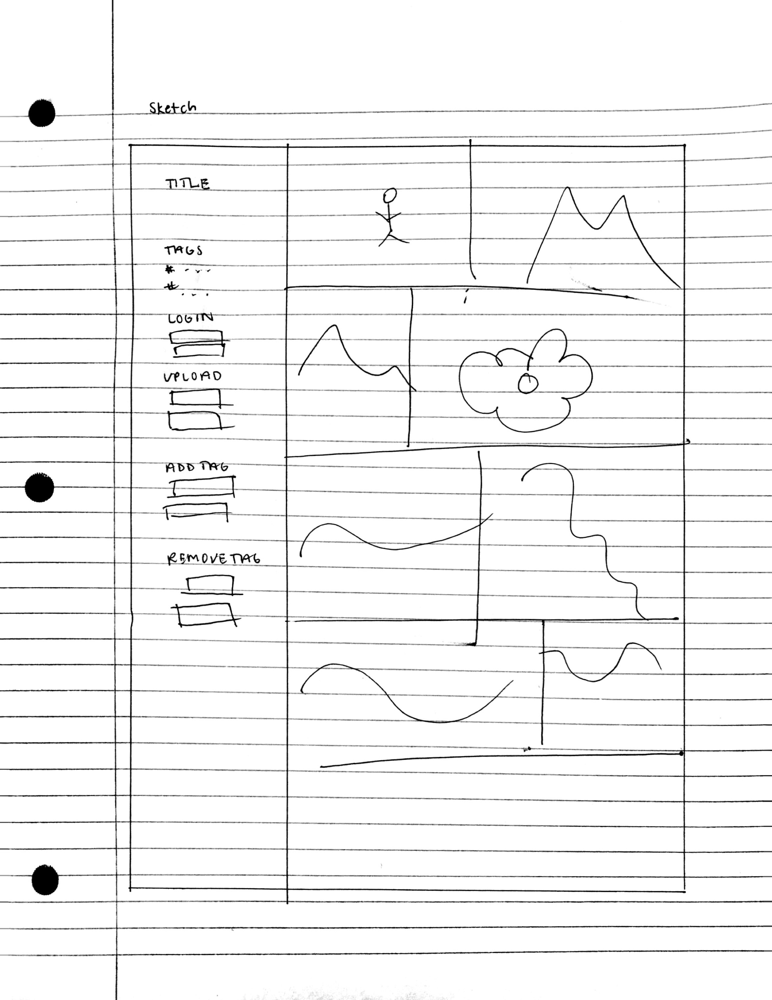
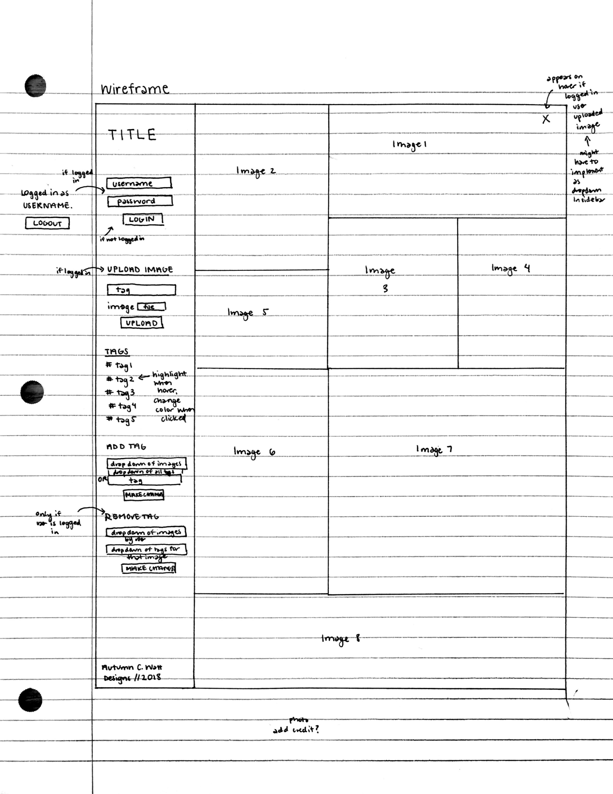

# Project 3 - Design & Plan

Your Name: Autumn C. Watt

> Hello. Please read through the comments we have left on your design plan and make sure to make
changes to your design plan and website based on the feedback we give you.
> Comments are listed inside block quotes like this, so make sure to look carefully!
> If a section in your design plan doesn’t have block quotes, then you’re good to go for that
section! If there are block quotes, there’s a good chance you’ve missed something crucial.

## 1. Persona

I've selected **[Abby]** as my persona.

I've selected my persona because... I strive to create a minimalistic, simple, and intuitive design that can easily be accessed by viewers. Only options available to the user will show (so no delete button if the user is not logged in). I plan on having a main bar on the side to keep all options and relevant info available.

## 2. Sketches & Wireframes

### Sketches



### Wirefames



[Explain why your design would be effective for your persona. 1-3 sentences.]

I believe my design would be effective for the Abby persona because it is one page and a lot of the features are responsive (tag changes a different color if mouse is hovered). All the user interactive features are on the sidebar.

> Your sketch and wireframe images do not render properly when I view the markdown file
> Great job on your wireframe, I like how you have a lot of notes which makes it easier for use to see your design process. It would be nice to see so notes regarding margin/spacing/sizing values of the various elements on the page
> Before the next submission make sure to fill in the "Explain why your design would be effective..."

## 3. Database Schema Plan

[Describe the structure of your database. You may use words or a picture. A bulleted list is probably the simplest way to do this.]

Table: photos
* id: INTEGER NOT NULL AUTOINCREMENT UNIQUE PRIMARY KEY
* user_id: INTEGER NOT NULL // user who uploaded picture
* image_path: TEXT NOT NULL
* cred: TEXT

Table: users
* id: INTEGER NOT NULL AUTOINCREMENT UNIQUE PRIMARY KEY
* username: TEXT NOT NULL
* password: TEXT NOT NULL
* session: INTEGER UNIQUE // random number generated

Table: tags
* id: INTEGER NOT NULL AUTOINCREMENT UNIQUE PRIMARY KEY
* tag: TEXT NOT NULL UNIQUE

Table: photo_tags
* id: INTEGER NOT NULL AUTOINCREMENT UNIQUE PRIMARY KEY
* tag_id: INTEGER NOT NULL
* photo_id: INTEGER NOT NULL

## 4. Database Query Plan

[Plan your database queries. You may use natural language, pseudocode, or SQL.]

// check login
* SELECT * FROM users where username = :username AND password = :password;
* Generate new session number

// check if session is active
* Make sure session key number is still valid

// logout
* Set session key to null

// view all images at once
* SELECT path FROM photos;

// view all images for a *tag* at once
* SELECT photo_id FROM photo_tags WHERE tag_id = :tag;

// view all tags for a *single* image
* SELECT tag_id FROM photo_tags WHERE photo_id = :photo;

// upload a new image
* INSERT INTO photos(user_id, path) VALUES (:user_id, :path);
* user must be logged in

// delete an image
// Make sure you clean up any relationships to the image in other tables. (Where the image is a foreign key.) Make sure you delete the corresponding file upload from disk.
* DELETE FROM photos WHERE photo_id = :photo;
* DELETE FROM photo_tags WHERE photo_id = :photo;
* user logged in must be the creator of the image

// view all tags at once
* SELECT tag FROM tags;

// add an existing tag to image
* INSERT INTO photo_tags(photo_id, tag_id) VALUES (:photo_id, :tag_id);

// add a new tag to an image
* INSERT INTO photo_tags(photo_id, tag_id) VALUES (:photo_id, :tag_id);

// remove a tag from an image
* DELETE FROM photo_tags WHERE tag_id = :tag;
* logged in user must be user who uploaded image

## 5. Structure and Pseudocode

### Structure

[List the PHP files you will have. You will probably want to do this with a bulleted list.]

* index.php - main page.
* includes/init.php - stuff that useful for every web page.
* sidebar.php - sidebar with pages, login info, and tags listed.

### Pseudocode

[For each PHP file, plan out your pseudocode. You probably want a subheading for each file.]

#### index.php

```
Pseudocode for index.php...

include init.php
include sidebar.php

query database for images

create array for images to be displayed

if tag is chosen
  add all photos to array with tag
else if no tag is chosen
  set queried images to the array

user-defined function to display photos in array
(I would like to give a fluid and seamless sized photogallery, but not sure how to accomplish this)

if photo displayed was created by logged in user
  display a hover x
  if hover x is clicked
    delete photo
(this might be ambitious)
```

#### includes/init.php

```
messages = array to store messages for user (you may remove this)

// DB helper functions (you do not need to write this out since they are provided.)

db = connect to db

query function

user login function

new session function

...

```

#### includes/sidebar.php

```
header title

print display messages

// LOGIN //
if user is not logged in
  display username textbox
  display password textbox
  display login button
else if user is logged in
  display message about who is logged in
  display logout button

if login button is pressed
  query database and create session
if logout button is pressed
  delete session

// UPLOAD FORM //
display tag box
display file upload
display submit button

if logged in
  submit button can hover and be pressed
  insert photo into database
  filter file and make sure obeys size constraints

// TAGS //
query database for all tags
display all tags in list fashion as hyperlinks

if hover over tag
  change color
else if tag is pressed (current tag)
  change view of gallery to only show photos with that tag

// ADD TAG //
query database for all photos
display all photos in a dropdown

query database for all tags
display all tags in a dropdown
display 'OR'
textbox for adding a new tag

create "make changes" button

if photo dropdown set and (tag dropdown set or tag textbox written) and button pressed
  insert new tag for image

// REMOVE TAG //
if user logged in
  query database for all photos created by user
  display in dropdown

  query database for all tags of the photo selected in first dropdown
  display in new dropdown

  create "make changes" button

  if first and second drop downs set and button pressed
    delete tag from image

// BOTTOM //
display credits to me for creating the website (kind of like footer)
```

## 6. Seed Data - Username & Passwords

[List the usernames and passwords for your users]

* user1 : janedoe
* password1: gobigred
* user2 : gm
* password2: liftthechorus

> ## Skeleton Website Feedback
> Initial skeleton looks good, your folder structure is complete and your database has proper seed data.
